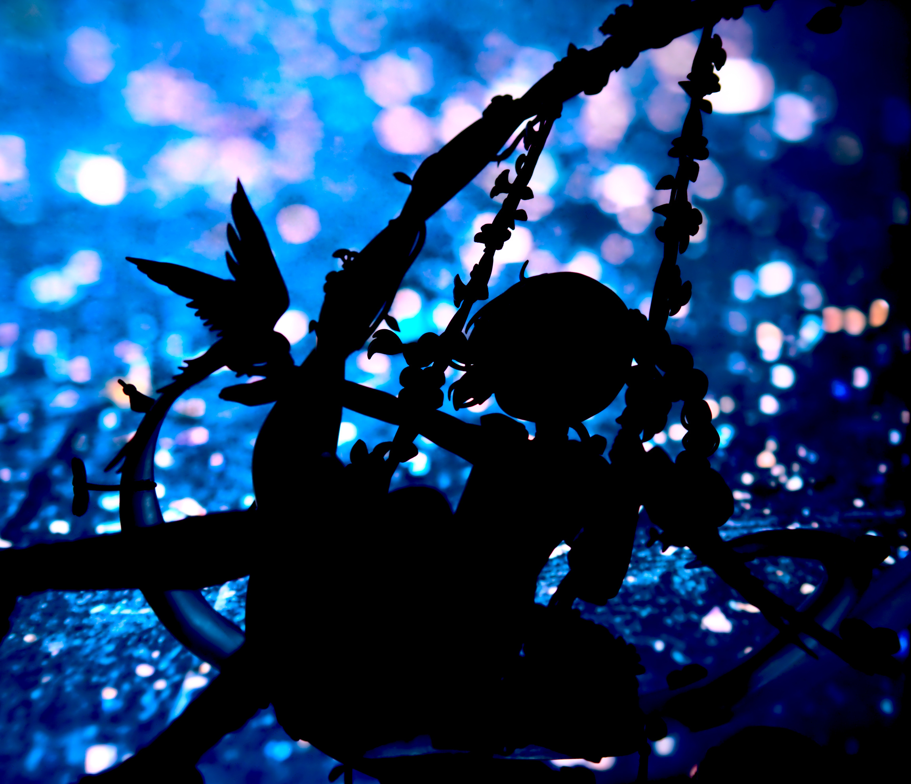
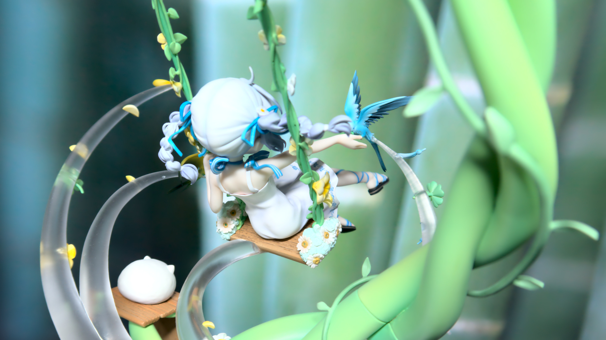
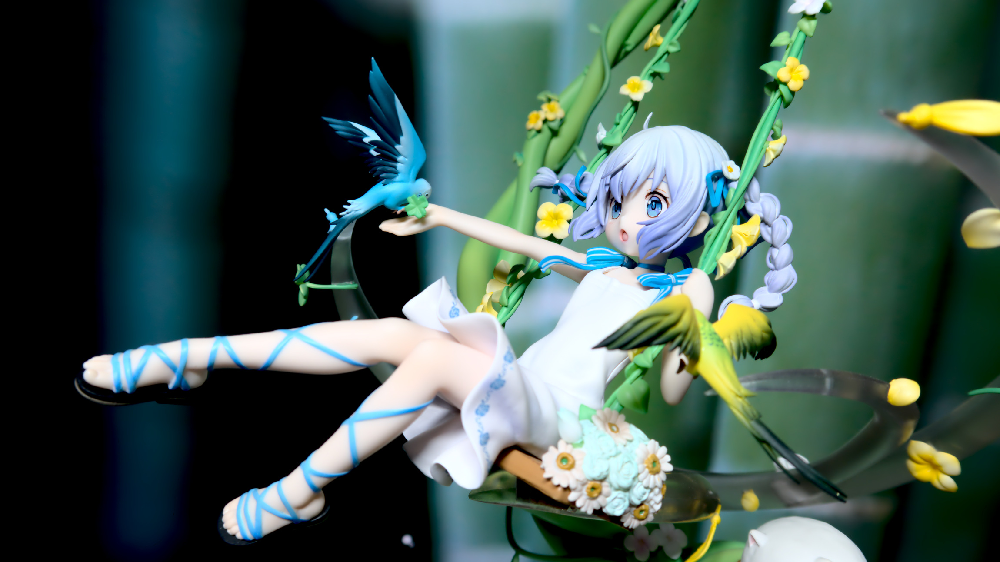
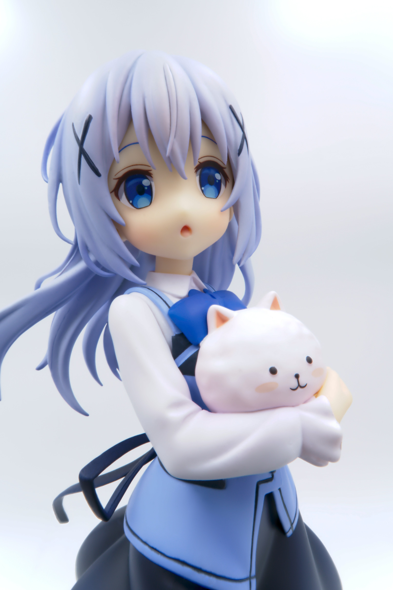
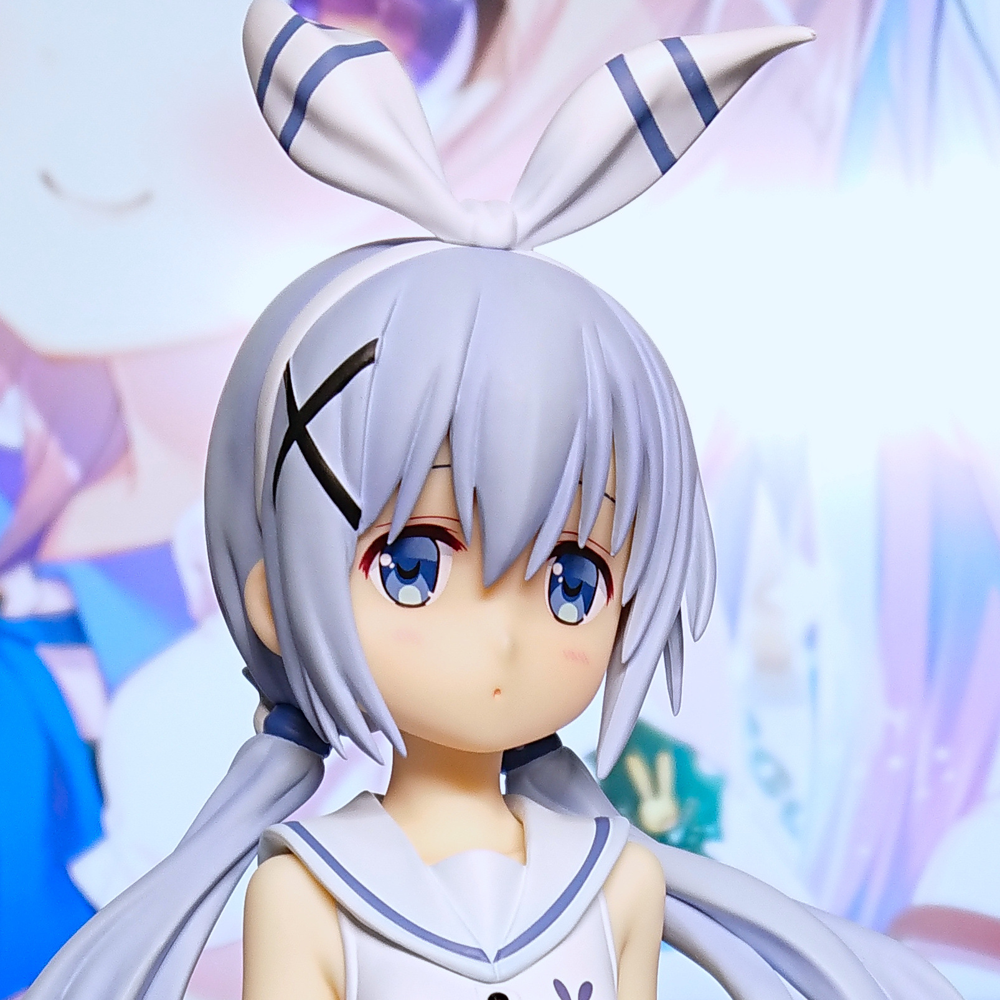
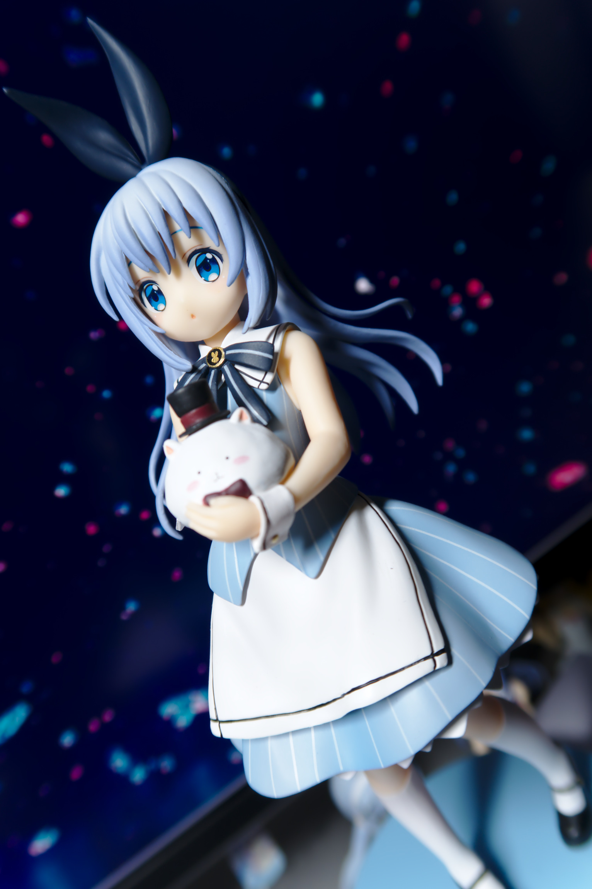
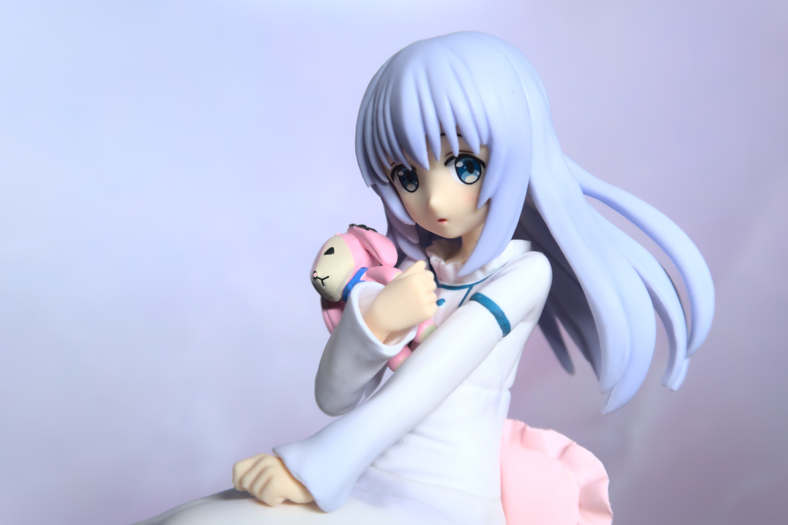

过去的一些智乃手办照片 ╰( ͡° ͜ʖ ͡° )つ ──☆\*:・ﾟ

# (FuRyu) Chino Ohana no Buranko

# (Stronger) Chino Mahou Shuojo ver.

# (GSC) Chino

# (PLUM) Chino Cafe Style

# (Easy Eight) Chino and Rabbit Dolls

拍的时候还没来得及部署周围的那六只小兔子 (¯ . ¯٥)

# (Chara-Ani, Toy's Works) Chino Cheer Girl

# (FuRyu) Chino Sailor ver.

不知为何感觉和可乐很搭（

# (FuRyu) Chino Tea Party ver.

# (SEGA) Chino Pajama ver.

